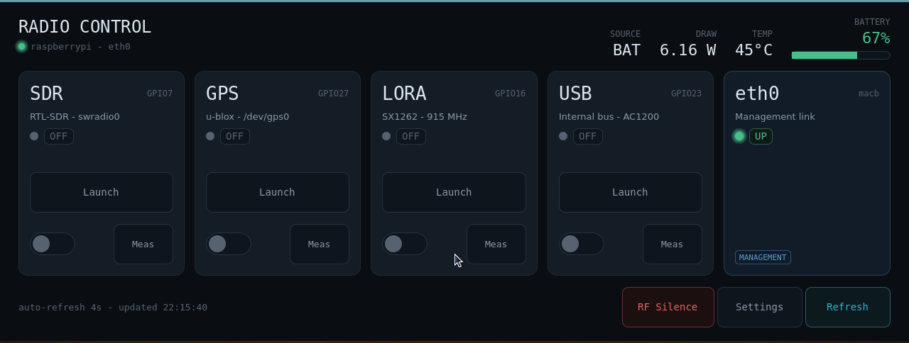
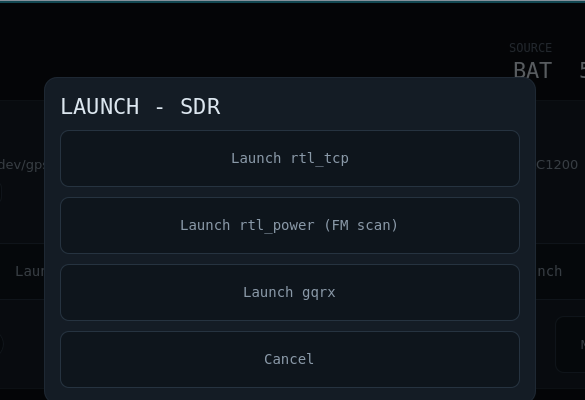

# uConsole AIO v2 — Radio Control GUI

A Godot touch UI for the ClockworkPi **uConsole** with the **HackerGadgets AIO v2** board.
Power the SDR / GPS / LoRa / internal-USB antenna rails on and off, watch live
power / battery / temperature telemetry, launch SDR tools per rail, and protect a
chosen management interface from being switched off by accident.



Per-rail **Launch** menu (programs are configurable — see below):



## Themes

Pick a theme in **Settings** (persisted to `config.json`):

- **Instrument** (default) — the field-radio instrument panel shown above.
- **Sonar (goofy)** — rail cards orbit a sonar scope, with a submarine ping
  every few seconds.
- **Cubes (goofy 3D)** — every rail card is textured onto all six faces of a
  floating 3D cube. Drag a cube (touch or mouse) to spin it; let go and it
  drifts back into a slow tumble. Taps are re-projected onto the face you hit,
  so toggles and buttons work from any face at any rotation.

In the goofy themes a stationary **Settings** button stays in the top-left
corner as the escape hatch back to a sensible UI.

## Platform

Built for the uConsole (CM5) + HackerGadgets AIO v2, running a DragonOS / Debian-based
Wayland session (labwc) at 1280×480. The app is a front-end over the device's own
tooling — it shells out to `aiov2_ctl`, reads `/sys`, and runs SDR utilities. On other
hardware it will open and render, but the controls won't do anything (there's no AIO
board to talk to).

## Dependencies

**To build / open the project**

- [Godot Engine **4.7**](https://godotengine.org/) — uses the GL Compatibility renderer.
  No addons or GDExtensions; it's a single scene + script.

**To control hardware at runtime** (already present on the uConsole / DragonOS):

- **`aiov2_ctl`** — HackerGadgets AIO v2 control + telemetry tool (rail power, `--status`,
  `--measure`, `--boot-rail`, `--sync-rtc`). Expected at `/usr/local/bin/aiov2_ctl`.
- **rtl-sdr** — `rtl_tcp`, `rtl_power`, `rtl_test` (for the SDR launch menu).
- **gqrx** — optional; offered as an SDR launcher.
- Standard Linux utilities: `pgrep`, `pkill`, `ip`, `cat`, `ls`, `readlink`, `hostname`,
  `setsid`, `sh`, and `sudo` (used only for RTC sync).
- A monospace font — prefers **DejaVu Sans Mono**, falls back to any monospace.

## Build & run

```sh
# run the project directly
godot --path .

# open it in the editor
godot -e --path .

# export a Linux binary (after adding a Linux export preset in the editor first)
godot --headless --path . --export-release "Linux" radio-ui.x86_64
```

To launch automatically on the device's desktop, add to `~/.config/labwc/autostart`:

```sh
/path/to/godot --path /path/to/radio-ui &
```

## Configuration

Settings persist to `~/.config/radio-ui/config.json`: which rails are shown, the
protected management interface, per-rail power-on-at-boot state, the theme, and the
**launcher** program lists. Add your own programs per rail — each entry has a `label`, a `cmd`, and a
`headless` flag:

```json
{
  "launchers": {
    "SDR": [
      { "label": "rtl_tcp", "cmd": "rtl_tcp -a 0.0.0.0", "headless": true },
      { "label": "gqrx",    "cmd": "gqrx",               "headless": false }
    ]
  },
  "launch_headless_only": false
}
```

## License

No license yet — add one if you'd like others to reuse this.
